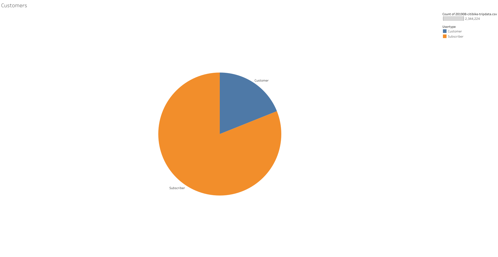
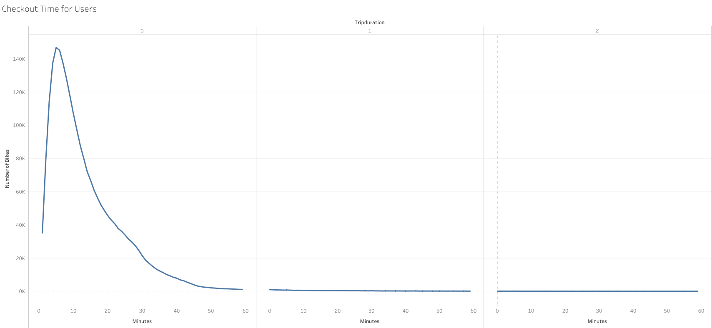
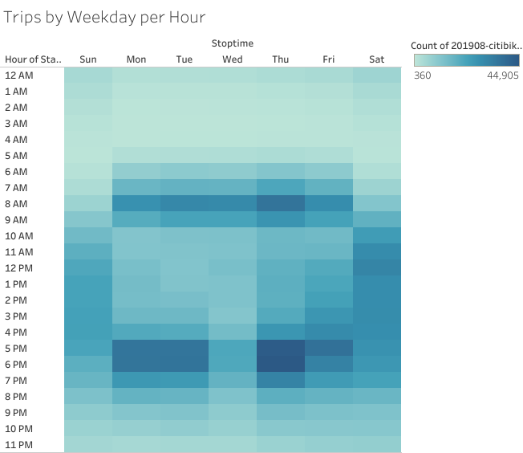

# bikesharing

## Overview of the Analysis
After a tirp to NYC and utilizing the bike-sharing program, we are interested in learning more about the business with the potential of bringing the business to Des Moines.  We have a potential investor and we need to dig deeper into our data to show our investors that it will be worth their while to bring this business to Des Moines.

## Results of the Analysis
Here we have a pie chart that will show us the proportion of short-term customers of the bike service to the annual subscribers.  Here we see that a majority of the customers are "subscribers" to the program, meaning most of the customers are annual subscribers to the bike-sharing service.  This is good new for a potential in Des Moines.  If the same type of customer is found in Des Moines, this would mean more long term business.

    
    
This next chart gives us peak hours for utilization of the bike sharing program.  We find that peak times are between 7-8am and then again from 5-6pm.  We are also able to see that around 9pm, there is a significant decrease in utilization up until around 6am when things begin to pick back up.  This is good information to help us know when we can take bikes off the road for repairs and other maintenance.

    
    
This line chart shows us the length of time that bikes are checked out for all riders.  This will help us in knowing how many bikes we may need as start our program.  

    
    
This line chart show us same information as above, but just breaks that information down by gender.  We see that a majority of our customers are male.

    
    
Here we have a heatmap graph showing us the number of bike trips by weekday for each hour of the day.  This graph tells us that 8am throughout the workweek is a high volume time, with Thursdays being the greatest volume.  Then, we see consistent high volume across the workweek from 5-6pm (with a bit of a decrease in volume on Wednesdays).  Also, to note with this graph, for the weekends, Saturdays are a high volume day starting around 10am and going to around 7pm.  

    
    
Again, we have the same information as above, only viewed by gender here.  Interestingly, we see that as for trends, both genders have similar trends throughout the workweek and the weekend.  Also, note that Saturdays seem to be more busy for the male gender than the female gender.

    .png)
    
Lastly, we have a heatmap graph that show us the number of bike trips broken down by gender for each day of the week by each usertype (short-term customer vs. annual subscribers).  We find that for our short-term customers, there is not much difference betweeen the genders number of users trips.  The customers that are annual subscribers, we find are more male trips than female trips made.

    
 
 ## Summary
 After reviewing the information from the NYC Cit Bike-Sharing Program.  There is enough information to give the investors a good idea of the type of customers we could see, the utilization high points and low points and have a good idea of the volume of utilization that could be expected.
